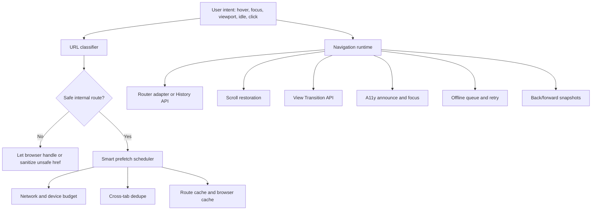

# rockzy-link

A production-ready navigation runtime with a React `<Link>` component.

Use the React component in React-based apps, or import the framework-neutral runtime from `rockzy-link/runtime` in Vue, Nuxt, SvelteKit, Angular, Solid, Qwik, Astro, or vanilla JavaScript.

---

## Key Features

- **URL Object Support & SSR-Safe Sanitization**: Environment-agnostic classifier filters unsafe protocols (e.g., `javascript:`, `vbscript:`, `data:`).
- **Smart Prefetch Scheduling**: Automatically tracks and queues viewport visibility, mouse hover, and browser idle events.
- **Network & Device Budgeting**: Budgets prefetching by concurrency, bandwidth usage per minute, device memory availability, and user `Save-Data` preference.
- **Cross-Tab Request Deduplication**: Synchronizes prefetches across tabs via `BroadcastChannel` with storage fallbacks to prevent redundant network requests.
- **Multi-Layer Route Cache**: Caches route data, RSC payloads, loaders, API responses, HTML, chunks, images, and fonts with TTL, stale-while-revalidate, tag-based, and mutation-based invalidation.
- **Unified Scroll Restoration**: Manages window scroll, hash offsets via CSS, and nested scroll containers (e.g., sidebars, tables).
- **Native View Transitions**: Automatically wraps transitions using `document.startViewTransition()` while respecting user reduced-motion preferences.
- **Accessibility & Focus Restoration**: Hidden route announcement region, skips navigation triggers, and focuses on semantic elements post-navigation.
- **Offline Navigation**: Queues failed navigations during offline status, registers service workers, and replays navigations in strict chronological order when online.
- **Instant Snapshots**: Cache DOM states for ultra-fast back/forward navigation.

---

## Install

```bash
npm install rockzy-link react @cacheable/node-cache
```

For non-React usage, React is optional:

```bash
npm install rockzy-link
```

---

## Quick Start (React)

```tsx
import { Link, LinkRuntimeProvider, createLinkRuntime } from "rockzy-link";

// Create a singleton runtime
const runtime = createLinkRuntime({
  prefetch: {
    concurrency: 4,
    bandwidthBudgetBytesPerMinute: 3_000_000,
    memoryBudgetBytes: 30_000_000
  }
});

export function App() {
  return (
    <LinkRuntimeProvider runtime={runtime}>
      <Link href="/dashboard" prefetch="viewport" viewTransition>
        Dashboard
      </Link>
    </LinkRuntimeProvider>
  );
}
```

---

## Package Overview

Most web applications start with basic anchor tags or simple router links, but production-grade user experiences require navigation to coordinate as a system. This package centralizes navigation concerns so links, dashboards, sidebars, and framework adapters behave consistently.

### Core Distinction

- **React Apps**: Use the high-level `<Link>` component directly from `rockzy-link`.
- **Non-React Frameworks**: Instantiate and connect the core runtime via `rockzy-link/runtime`.

### Architecture Flow



### Import Map

| Import | Use Case |
| --- | --- |
| `rockzy-link` | React component plus all public utilities |
| `rockzy-link/runtime` | Framework-neutral runtime engine |
| `rockzy-link/cache` | In-memory client-side route cache |
| `rockzy-link/cache/browser` | Browser Cache Storage helpers |
| `rockzy-link/cache/node` | `@cacheable/node-cache` server-side cache adapter |
| `rockzy-link/prefetch` | Smart prefetch scheduler and priority queue |
| `rockzy-link/security` | URL classification and sanitization |
| `rockzy-link/navigation/scroll` | Scroll restoration and container manager |
| `rockzy-link/navigation/view-transitions` | View Transition helper functions |
| `rockzy-link/service-worker` | Offline service worker script string |

### Mental Model

Use `rockzy-link` as a **traffic controller**. Your framework still owns rendering and route matching. This package decides when it is safe and worthwhile to warm routes, navigate, restore scroll position, announce updates, animate page changes, retry requests, or evict cache entries.

---

## Developer Guide & Core Concepts

### 1. Prefetch Modes

Customize prefetch triggers on a link-by-link basis:

```tsx
<Link href="/pricing" prefetch="hover">Pricing</Link>
<Link href="/dashboard" prefetch="viewport">Dashboard</Link>
<Link href="/legal" prefetch="idle">Legal</Link>
<Link href="/billing" prefetch="none">Billing</Link>
```

- **`hover`**: High priority. Schedules a prefetch when user pointer intent is clear (includes a movement delay to ignore quick hover fly-bys).
- **`viewport`**: Medium priority. Schedules prefetching when the link enters the viewport, ordered by visibility.
- **`idle`**: Low priority. Triggers speculative prefetching when the browser is idle.
- **`none`**: Disables preprefetching entirely. Highly recommended for expensive, private, or mutation-sensitive endpoints.

### 2. Route Cache

Use the client-side route cache to reuse data across views. Cache kinds include: `route-data`, `rsc`, `loader`, `api`, `html`, `script`, `image`, and `font`.

```ts
runtime.routeCache.set("/api/user/42", "api", user, {
  ttlMs: 60_000,
  staleWhileRevalidateMs: 15_000,
  tags: ["user:42"]
});

const cached = runtime.routeCache.get("/api/user/42", "api");
```

Invalidate cache entries following mutations:

```ts
runtime.routeCache.invalidateMutation("/settings", ["settings", "user:42"]);
```

> [!NOTE]
> Client cache is for client-side reuse. Keep server cache invalidation in your framework, and use this cache for client-side warm data and navigation metadata.

### 3. Scroll Restoration

Window scroll restoration is automatic. For custom scroll areas (e.g. dashboards, scrollable lists), register them using an ID attribute:

```tsx
<aside data-scroll-restoration-id="sidebar" />
```

Or programmatically:

```tsx
useEffect(() => {
  if (!ref.current) return;
  return runtime.scroll.registerContainer("sidebar", ref.current);
}, [runtime]);
```

Hash anchor offsets can be adjusted using CSS variables:

```css
:root {
  --route-scroll-offset: 72px; /* Offset for floating headers */
}
```

### 4. View Transitions

```tsx
<Link href="/reports" viewTransition>
  Reports
</Link>
```

The runtime wraps transitions inside `document.startViewTransition()` if the browser supports it, falling back to instant navigation if unsupported. Reduced-motion preferences are respected automatically.

### 5. Accessibility (A11y)

Upon route change, the runtime announces the update using an invisible ARIA live region and restores keyboard focus in this order:
1. Elements matching `[data-route-focus]`
2. `main h1`
3. `h1`
4. `main`
5. `[role="main"]`

Skip links are also supported:

```tsx
import { SkipNavigation } from "rockzy-link";

<SkipNavigation className="skip-link" targetId="main-content" />
<main id="main-content">
  <h1 data-route-focus>Dashboard</h1>
</main>
```

### 6. Offline Navigation

Register the built-in offline service worker:

```ts
runtime.offline.register("/sw.js");
```

Write the worker file to your public folder using the exported string template:

```ts
import { OFFLINE_NAVIGATION_SERVICE_WORKER } from "rockzy-link/service-worker";
```

Failed offline navigations are queued and sequentially flushed strict in-order when the browser regains connection, avoiding LocalStorage race conditions.

### 7. Performance & Safety Details

- **O(N) Snapshot Eviction**: The snapshot eviction algorithms in `ScrollRestorationManager` and `NavigationSnapshotCache` use a single-pass linear O(N) scan. This avoids garbage collection overhead and O(N log N) sorting associated with array clones, ensuring a zero-lag experience.
- **Sequential Queue Flushing**: When transitioning from offline to online, the `OfflineNavigationManager` sequentially flushes the offline queue using `await` on each transition to prevent concurrent write race conditions.

---

## API Reference

### 1. `<Link />` Props

| Prop | Type | Default | Purpose |
| --- | --- | --- | --- |
| `href` | `string \| URL` | *Required* | Destination URL |
| `replace` | `boolean` | `false` | Replace current history entry instead of pushing |
| `scroll` | `boolean \| string` | `true` | Scroll to top, scroll to specific element ID, or disable scroll restoration |
| `scrollBehavior` | `"auto" \| "smooth" \| "instant"` | `"auto"` | Navigation scroll transition behavior |
| `prefetch` | `"hover" \| "viewport" \| "idle" \| "none" \| false` | `"hover"` | Prefetch trigger action |
| `prefetchPriority` | `"high" \| "medium" \| "low"` | *Inferred* | Override default scheduler priority |
| `router` | `LinkRouter` | *None* | Router adapter for frameworks |
| `state` | `unknown` | *None* | History state object attached to the navigation |
| `viewTransition` | `boolean` | `false` | Use the View Transition API |
| `disabled` | `boolean` | `false` | Render a disabled `span` instead of `a` |
| `download` | `boolean \| string` | *None* | Native download attribute |
| `cacheTags` | `readonly string[]` | *None* | Invalidation tags for prefetched cache entry |
| `cacheTtlMs` | `number` | *Runtime default* | Cache TTL override |
| `staleWhileRevalidateMs` | `number` | *Runtime default* | Stale-while-revalidate duration override |
| `estimateBytes` | `number` | `128000` | Budget weight estimate for scheduler |
| `hashOffset` | `number` | *CSS/Default* | Pixel offset for hash scrolling |
| `focus` | `boolean \| string` | *Runtime default* | Programmatic focus destination selector |
| `announce` | `boolean \| string` | *Runtime default* | Live region announcement text override |
| `fallbackHref` | `string` | *None* | Fallback URL to load if navigation fails |

#### Event Props

```tsx
<Link
  href="/account"
  onBeforeNavigate={async (href) => {
    return await confirmNavigation(href); // Return false to block
  }}
  onNavigate={(href) => analytics.track("navigate", { href })}
  onNavigateError={(error, href) => logError(error, href)}
>
  Account
</Link>
```

### 2. `createLinkRuntime(options)`

Creates the main navigation runtime instance.

```ts
import { createLinkRuntime } from "rockzy-link/runtime";

const runtime = createLinkRuntime({
  prefetch: {
    concurrency: 4,
    bandwidthBudgetBytesPerMinute: 2_500_000,
    memoryBudgetBytes: 50_000_000,
    crossTabDedupe: true
  },
  a11y: {
    announce: true,
    restoreFocus: true,
    focusSelector: "[data-route-focus]"
  },
  offline: {
    enabled: true,
    optimistic: true
  },
  viewTransition: {
    enabled: true,
    respectReducedMotion: true
  },
  scroll: {
    restoreOnPopState: true
  }
});
```

#### Runtime Instance Methods

- `runtime.prefetch(href, options)`: Explicitly schedules a prefetch.
- `runtime.navigate(href, options)`: Triggers navigation via router adapter or History API.
- `runtime.destroy()`: Cancels background tasks, detaches event listeners.
- `runtime.routeCache.get(key, kind)`: Retrieves entries.
- `runtime.routeCache.set(key, kind, data, options)`: Stores data in cache.
- `runtime.routeCache.invalidateTag(tag)`: Invalidates all entries matching the tag.
- `runtime.routeCache.invalidateMutation(href, tags)`: Purges paths and tags on mutation.
- `runtime.scroll.registerContainer(id, element)`: Registers nested scroll views.
- `runtime.offline.register(swUrl)`: Registers the service worker path.
- `runtime.offline.queueNavigation(href)`: Manually queues navigation.

### 3. Router Adapter Shape

Adapters interface the runtime with client router frameworks:

```ts
type LinkRouter = {
  push: (
    href: string,
    opts?: { replace?: boolean; state?: unknown }
  ) => void | Promise<void>;
  prefetch?: (href: string) => void | Promise<void>;
};
```

---

## Framework Recipes

Coordinate this package's intent-driven scheduler, budgeting, and cache with your favorite web framework.

### Next.js App Router

```tsx
"use client";

import { useRouter } from "next/navigation";
import { Link, LinkRuntimeProvider, createLinkRuntime } from "rockzy-link";

const runtime = createLinkRuntime({
  prefetch: { concurrency: 3, bandwidthBudgetBytesPerMinute: 2_000_000 }
});

export function SmartNextLink(props: Omit<React.ComponentProps<typeof Link>, "router">) {
  const nextRouter = useRouter();

  return (
    <LinkRuntimeProvider runtime={runtime}>
      <Link
        {...props}
        router={{
          push: (href, opts) => {
            if (opts?.replace) nextRouter.replace(href);
            else nextRouter.push(href);
          },
          prefetch: (href) => nextRouter.prefetch(href)
        }}
      />
    </LinkRuntimeProvider>
  );
}
```

### Next.js Pages Router

```tsx
import { useRouter } from "next/router";
import { Link } from "rockzy-link";

export function SmartPagesLink(props: Omit<React.ComponentProps<typeof Link>, "router">) {
  const router = useRouter();

  return (
    <Link
      {...props}
      router={{
        push: (href, opts) => {
          if (opts?.replace) return router.replace(href, undefined, { scroll: false });
          return router.push(href, undefined, { scroll: false });
        },
        prefetch: (href) => router.prefetch(href)
      }}
    />
  );
}
```

### React Router

```tsx
import { useNavigate } from "react-router";
import { Link } from "rockzy-link";

export function SmartReactRouterLink(props: Omit<React.ComponentProps<typeof Link>, "router">) {
  const navigate = useNavigate();

  return (
    <Link
      {...props}
      router={{
        push: (href, opts) =>
          navigate(href, {
            replace: opts?.replace,
            state: opts?.state
          })
      }}
    />
  );
}
```

### TanStack Router

```tsx
import { useRouter } from "@tanstack/react-router";
import { Link } from "rockzy-link";

export function SmartTanStackLink({
  to,
  ...props
}: Omit<React.ComponentProps<typeof Link>, "href" | "router"> & { to: string }) {
  const router = useRouter();

  return (
    <Link
      {...props}
      href={to}
      router={{
        push: (href, opts) =>
          router.navigate({
            to: href,
            replace: opts?.replace
          }),
        prefetch: (href) =>
          router.preloadRoute({
            to: href
          })
      }}
    />
  );
}
```

### Remix

```tsx
import { useNavigate } from "@remix-run/react";
import { Link } from "rockzy-link";

export function SmartRemixLink(props: Omit<React.ComponentProps<typeof Link>, "router">) {
  const navigate = useNavigate();

  return (
    <Link
      {...props}
      router={{
        push: (href, opts) =>
          navigate(href, {
            replace: opts?.replace,
            state: opts?.state
          })
      }}
    />
  );
}
```

### Vue 3 + Vue Router

`src/navigation/runtime.ts`:

```ts
import { createLinkRuntime } from "rockzy-link/runtime";

export const runtime = createLinkRuntime({
  prefetch: { concurrency: 4, crossTabDedupe: true }
});
```

`SmartLink.vue`:

```vue
<script setup lang="ts">
import { computed } from "vue";
import { useRouter } from "vue-router";
import { runtime } from "./navigation/runtime";

const props = defineProps<{
  to: string;
  replace?: boolean;
  prefetch?: "hover" | "viewport" | "idle" | "none";
}>();

const router = useRouter();
const href = computed(() => props.to);

function priority() {
  if (props.prefetch === "viewport") return "medium";
  if (props.prefetch === "idle") return "low";
  return "high";
}

function warm() {
  if (props.prefetch === "none") return;
  runtime.prefetch(href.value, { priority: priority() });
}

async function go(event: MouseEvent) {
  if (event.metaKey || event.ctrlKey || event.shiftKey || event.altKey) return;
  event.preventDefault();

  await runtime.navigate(href.value, {
    router: {
      push: (url) => {
        if (props.replace) return router.replace(url);
        return router.push(url);
      }
    },
    viewTransition: true
  });
}
</script>

<template>
  <a :href="href" @mouseenter="warm" @focus="warm" @click="go">
    <slot />
  </a>
</template>
```

### Nuxt

`plugins/production-link.client.ts`:

```ts
import { createLinkRuntime } from "rockzy-link/runtime";

export default defineNuxtPlugin(() => {
  const runtime = createLinkRuntime({
    prefetch: { concurrency: 3, bandwidthBudgetBytesPerMinute: 2_000_000 }
  });

  return { provide: { productionLink: runtime } };
});
```

`Component.vue`:

```vue
<script setup lang="ts">
const props = defineProps<{ to: string }>();
const { $productionLink } = useNuxtApp();

function warm() {
  $productionLink.prefetch(props.to, {
    priority: "high",
    fetcher: async (href) => {
      await preloadRouteComponents(href);
    }
  });
}

async function go(event: MouseEvent) {
  event.preventDefault();
  await $productionLink.navigate(props.to, {
    router: { push: (href) => navigateTo(href) },
    viewTransition: true
  });
}
</script>

<template>
  <a :href="to" @mouseenter="warm" @focus="warm" @click="go">
    <slot />
  </a>
</template>
```

### SvelteKit

`src/lib/navigation.ts`:

```ts
import { createLinkRuntime } from "rockzy-link/runtime";

export const runtime = createLinkRuntime();
```

`SmartLink.svelte`:

```svelte
<script lang="ts">
  import { goto, preloadData } from "$app/navigation";
  import { runtime } from "$lib/navigation";

  export let href: string;
  export let replace = false;

  function warm() {
    runtime.prefetch(href, {
      priority: "high",
      fetcher: async (url) => { await preloadData(url); }
    });
  }

  async function go(event: MouseEvent) {
    if (event.metaKey || event.ctrlKey || event.shiftKey || event.altKey) return;
    event.preventDefault();

    await runtime.navigate(href, {
      router: {
        push: (url) => goto(url, { replaceState: replace, noScroll: true })
      },
      viewTransition: true
    });
  }
</script>

<a {href} on:mouseenter={warm} on:focus={warm} on:click={go}>
  <slot />
</a>
```

### Angular

`production-link.runtime.ts`:

```ts
import { createLinkRuntime } from "rockzy-link/runtime";

export const productionLinkRuntime = createLinkRuntime();
```

`production-link.directive.ts`:

```ts
import { Directive, HostListener, Input } from "@angular/core";
import { Router } from "@angular/router";
import { productionLinkRuntime } from "./production-link.runtime";

@Directive({
  selector: "a[productionLink]",
  standalone: true
})
export class ProductionLinkDirective {
  @Input("productionLink") href = "/";
  @Input() replace = false;

  constructor(private readonly router: Router) {}

  @HostListener("mouseenter")
  @HostListener("focus")
  warm() {
    productionLinkRuntime.prefetch(this.href, { priority: "high" });
  }

  @HostListener("click", ["$event"])
  async click(event: MouseEvent) {
    if (event.metaKey || event.ctrlKey || event.shiftKey || event.altKey) return;
    event.preventDefault();

    await productionLinkRuntime.navigate(this.href, {
      router: {
        push: (href) => this.router.navigateByUrl(href, { replaceUrl: this.replace })
      },
      viewTransition: true
    });
  }
}
```

```html
<!-- usage -->
<a productionLink="/dashboard">Dashboard</a>
```

### Solid Router

```tsx
import { useNavigate } from "@solidjs/router";
import { createLinkRuntime } from "rockzy-link/runtime";

const runtime = createLinkRuntime();

export function SmartSolidLink(props: { href: string; children: any }) {
  const navigate = useNavigate();

  const warm = () => { runtime.prefetch(props.href, { priority: "high" }); };

  const go = async (event: MouseEvent) => {
    if (event.metaKey || event.ctrlKey || event.shiftKey || event.altKey) return;
    event.preventDefault();

    await runtime.navigate(props.href, {
      router: { push: (href) => navigate(href) },
      viewTransition: true
    });
  };

  return (
    <a href={props.href} onMouseEnter={warm} onFocus={warm} onClick={go}>
      {props.children}
    </a>
  );
}
```

### Qwik City

```tsx
import { component$ } from "@builder.io/qwik";
import { useNavigate } from "@builder.io/qwik-city";
import { createLinkRuntime } from "rockzy-link/runtime";

const runtime = createLinkRuntime();

export const SmartQwikLink = component$((props: { href: string }) => {
  const nav = useNavigate();

  return (
    <a
      href={props.href}
      onMouseEnter$={() => runtime.prefetch(props.href, { priority: "high" })}
      onClick$={async (event) => {
        event.preventDefault();
        await runtime.navigate(props.href, {
          router: { push: (href) => nav(href) }
        });
      }}
    >
      <slot />
    </a>
  );
});
```

### Astro

```astro
---
// Astro Component
---
<a href="/docs" data-smart-link>Docs</a>

<script>
  import { createLinkRuntime } from "rockzy-link/runtime";
  const runtime = createLinkRuntime();

  for (const link of document.querySelectorAll("[data-smart-link]")) {
    const href = link.getAttribute("href");
    if (!href) continue;

    link.addEventListener("mouseenter", () => {
      runtime.prefetch(href, { priority: "high" });
    });

    link.addEventListener("click", (event) => {
      event.preventDefault();
      runtime.navigate(href, { viewTransition: true });
    });
  }
</script>
```

### Vite SPA or Vanilla JS

Without an adapter, the runtime relies on the HTML5 History API:

```ts
import { createLinkRuntime } from "rockzy-link/runtime";

const runtime = createLinkRuntime();

document.addEventListener("click", async (event) => {
  const target = event.target as HTMLElement;
  const anchor = target.closest<HTMLAnchorElement>("a[data-route]");
  if (!anchor) return;

  event.preventDefault();
  await runtime.navigate(anchor.href, { viewTransition: true });
});

window.addEventListener("production-link:navigate", (event) => {
  const href = (event as CustomEvent).detail.href;
  renderRoute(href);
});
```

### htmx

Keep htmx in charge of HTML swaps while utilizing the runtime for prefetching and routing validation:

```html
<a href="/inbox" hx-get="/inbox" hx-target="#main" data-smart-prefetch>
  Inbox
</a>

<script type="module">
  import { createLinkRuntime } from "rockzy-link/runtime";
  const runtime = createLinkRuntime();

  document.addEventListener("mouseenter", (event) => {
    const link = event.target.closest("[data-smart-prefetch]");
    if (!link) return;
    runtime.prefetch(link.href, { priority: "high" });
  }, true);
</script>
```

### Framework Selection Guide

| Framework | Uses React `<Link>`? | Preferred Import | Primary Navigation Owner |
| --- | --- | --- | --- |
| **React SPA** | Yes | `rockzy-link` | Runtime / Client Router |
| **Next.js** | Yes (wrapper) | `rockzy-link` | Next.js Router |
| **Remix** | Yes | `rockzy-link` | Remix Router |
| **React Router** | Yes | `rockzy-link` | React Router |
| **TanStack Router** | Yes | `rockzy-link` | TanStack Router |
| **Vue 3** | No | `rockzy-link/runtime` | Vue Router |
| **Nuxt** | No | `rockzy-link/runtime` | Nuxt Engine |
| **SvelteKit** | No | `rockzy-link/runtime` | SvelteKit Navigation |
| **Angular** | No | `rockzy-link/runtime` | Angular Router |
| **Solid** | Usually No | `rockzy-link/runtime` | Solid Router |
| **Qwik** | No | `rockzy-link/runtime` | Qwik City Router |
| **Astro** | Island Only | `rockzy-link` / `/runtime` | Astro Transitions / Runtime |
| **Vanilla** | No | `rockzy-link/runtime` | Runtime History API |

---

## Integration Code Snaps

### App Root Setup (React)

```tsx
import { createRoot } from "react-dom/client";
import { LinkRuntimeProvider, createLinkRuntime } from "rockzy-link";
import { App } from "./app";

const runtime = createLinkRuntime();

createRoot(document.getElementById("root")!).render(
  <LinkRuntimeProvider runtime={runtime}>
    <App />
  </LinkRuntimeProvider>
);
```

### Guarded / Protected Routes

```tsx
<Link
  href="/account"
  prefetch="none"
  onBeforeNavigate={async () => {
    const isSessionValid = await confirmSession();
    return isSessionValid; // Returns false to cancel navigation
  }}
>
  Account
</Link>
```

### Manual Mutation Invalidation

```ts
async function updateProfile(input: ProfileInput) {
  await api.profile.update(input);
  // Clear cached data on mutation
  runtime.routeCache.invalidateMutation("/profile", ["profile", "user"]);
}
```

### Dense / Smart Sidebars

```tsx
function Sidebar() {
  return (
    <nav>
      {items.map((item) => (
        <Link
          key={item.href}
          href={item.href}
          prefetch="hover"
          estimateBytes={96_000}
          cacheTags={item.tags}
        >
          {item.label}
        </Link>
      ))}
    </nav>
  );
}
```

> [!TIP]
> Smart pointer intent delays trigger during hover events. Quick cursor sweeps across a dense sidebar won't flood the browser with resource-fetching requests.

### Node Server Cache Setup

When utilizing the `createNodeRouteCache` wrapper, invalidations propagate down to evict entries in both the in-memory cache and server-side database.

```ts
import { createNodeRouteCache } from "rockzy-link/cache/node";

const cache = await createNodeRouteCache({
  maxEntries: 2_000,
  maxBytes: 200_000_000
});

cache.set("/api/products", "api", products, {
  ttlMs: 120_000,
  tags: ["products"]
});
```

### Browser Cache Storage warming

```ts
import { prefetchToBrowserCache } from "rockzy-link/cache/browser";

await prefetchToBrowserCache("/docs/getting-started");
```

---

## Lessons, Tips, and Tricks

1. **Prefetch Less, But Earlier**: A fast site doesn't load everything. It loads the right thing at the right time. Use `hover` for high-confidence links, `viewport` for primary content, and `idle` for cheap background prefetching.
2. **Set Budgets Wisely**: Do not let every third-party script flood the connection. Designate this runtime as the singular manager of prefetch budgeting.
3. **Mutation Invalidation Tags**: Avoid using general tag categories (e.g. `data`, `page`). Use domain-specific concepts like `user:42` or `project:abc` so that mutations invalidate exactly what is necessary.
4. **Scroll restoration is not an afterthought**: Ensure any scrollable nested panels use `data-scroll-restoration-id` attributes to guarantee consistent scroll layouts during session history navigation.
5. **View Transitions**: Always keep `respectReducedMotion: true` enabled. Never force page transitions on users with motion sensitivities.

---

## Production Checklist

- [x] Unsafe URLs are sanitized and resolve to `#`.
- [x] External URLs automatically apply `noopener noreferrer`.
- [x] Prefetching is explicitly set to `none` on mutation-sensitive or secure pages.
- [x] Hover delays are configured to prevent menu scans from flooding the network.
- [x] Viewport links are configured and ordered by layout visibility.
- [x] Back/forward navigation actions restore both main and nested container scrolls.
- [x] Accessibility live regions announce new paths and reset keyboard focus.
- [x] Reduced-motion preferences are respected during page animations.
- [x] All cache mutations are explicitly configured with invalidation tags.
- [x] Offline Service Worker is registered in supportive environments.
- [x] Code passes `npm run typecheck`, `npm run build`, and `npm test`.

---

## License

MIT License. See [LICENSE](file:///c:/Users/domin/OneDrive/Documents/New%20project/LICENSE) for details.
