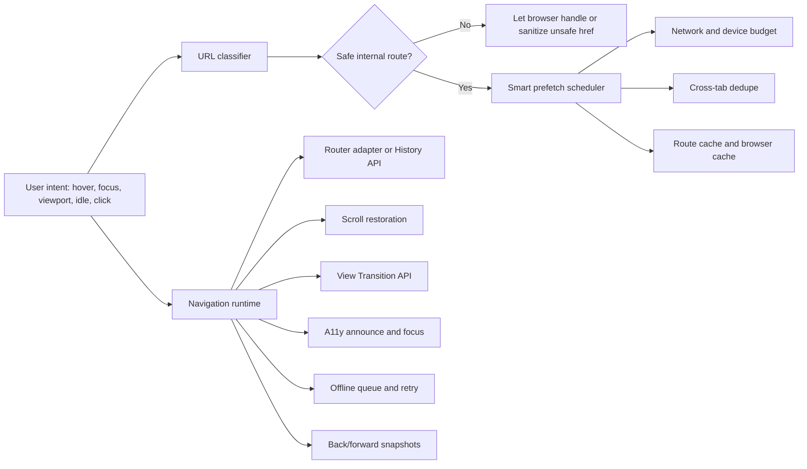

# Package Overview

`rockzy-link` is a navigation runtime plus a React `<Link>` component.

The important distinction:

- React apps can use the `<Link>` component.
- Any framework can use the runtime directly through `rockzy-link/runtime`.

## What The Package Solves

Most apps start with a simple link and later discover navigation is actually a system:

- Is this URL safe to render?
- Should this route be prefetched?
- Is the network already busy?
- Did another tab already prefetch this route?
- Should scroll reset, restore, or move to a hash target?
- Should the page announce a route change?
- Can the navigation animate?
- What happens offline?
- How do back and forward feel instant?
- What cache entries should a mutation invalidate?

This package centralizes those decisions in a runtime so links, routers, dashboards, menus, and framework adapters behave consistently.

## Package Parts

### React Component

Import from the root package:

```tsx
import { Link, LinkRuntimeProvider } from "rockzy-link";
```

Use this in React, Next.js client components, Remix, React Router, TanStack Router, Astro React islands, and Vite React SPAs.

### Framework-Neutral Runtime

Import from the runtime subpath:

```ts
import { createLinkRuntime } from "rockzy-link/runtime";
```

Use this in Vue, Nuxt, SvelteKit, Angular, Solid, Qwik, Astro scripts, custom routers, and vanilla JavaScript.

### Cache Utilities

```ts
import { RouteCache } from "rockzy-link/cache";
import { prefetchToBrowserCache } from "rockzy-link/cache/browser";
import { createNodeRouteCache } from "rockzy-link/cache/node";
```

### Prefetch Scheduler

```ts
import { SmartPrefetchScheduler } from "rockzy-link/prefetch";
```

The `SmartPrefetchScheduler` is fully isomorphic/SSR-safe, employing environment-agnostic timeout scheduling so that it can be safely imported and executed in node environments.

### URL Security

```ts
import { classifyHref, sanitizeHref } from "rockzy-link/security";
```

## How It Works



## Runtime Lifecycle

1. A link, component, or framework adapter calls `runtime.prefetch()` or `runtime.navigate()`.
2. The URL classifier rejects unsafe protocols such as `javascript:`.
3. Prefetch requests enter a priority queue.
4. The scheduler applies concurrency, network, device, memory, and stale-task budgets.
5. The scheduler deduplicates same-route work locally and across tabs.
6. Successful responses can warm the route cache and browser Cache Storage.
7. Navigation saves current scroll and DOM snapshots.
8. The runtime delegates to a router adapter when provided.
9. Without an adapter, the runtime uses the History API and dispatches route events.
10. After navigation, it restores scroll, announces the change, restores focus, and runs view transitions if available.

## Import Map

| Import | Use |
| --- | --- |
| `rockzy-link` | React component plus all public utilities |
| `rockzy-link/runtime` | Framework-neutral runtime |
| `rockzy-link/cache` | In-memory route cache |
| `rockzy-link/cache/browser` | Browser Cache Storage helpers |
| `rockzy-link/cache/node` | `@cacheable/node-cache` adapter |
| `rockzy-link/prefetch` | Smart prefetch scheduler |
| `rockzy-link/security` | URL classification and sanitization |
| `rockzy-link/navigation/scroll` | Scroll restoration manager |
| `rockzy-link/navigation/view-transitions` | View Transition helper |
| `rockzy-link/service-worker` | Offline service worker script string |

## Mental Model

Use the runtime as a traffic controller.

Your framework still owns rendering and route matching. This package decides when it is safe and worthwhile to warm, navigate, restore, announce, animate, retry, or evict.

