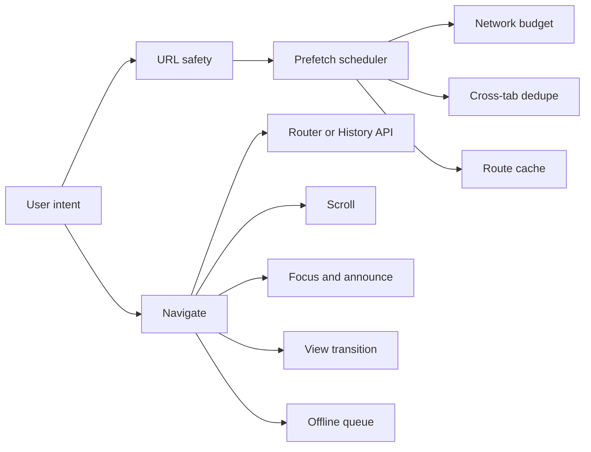

# Package Overview

`rockzy-link` is a navigation helper. It is not a router.

Use it when you already have navigation, but you want the pieces around navigation to behave well:

- safe URLs
- prefetching
- route caching
- scroll restoration
- focus and announcements
- View Transitions
- offline recovery
- performance measurements

## Two Ways To Use It

### React Apps

Use the React component:

```tsx
import { Link } from "rockzy-link";

<Link href="/dashboard">Dashboard</Link>
```

You can also use `to` if your team is used to React Router:

```tsx
<Link to="/settings">Settings</Link>
```

### Any Framework

Use the runtime:

```ts
import { createLinkRuntime } from "rockzy-link/runtime";

const runtime = createLinkRuntime();
```

Then connect your router:

```ts
await runtime.navigate("/dashboard", {
  router: {
    push: (href) => appRouter.push(href),
    prefetch: (href) => appRouter.prefetch?.(href)
  }
});
```

## What It Does



## Public Imports

| Import | Use |
| --- | --- |
| `rockzy-link` | React component and public utilities |
| `rockzy-link/runtime` | Runtime without importing React |
| `rockzy-link/cache` | In-memory route cache |
| `rockzy-link/cache/browser` | Browser Cache Storage helpers |
| `rockzy-link/cache/node` | Node cache adapter |
| `rockzy-link/prefetch` | Smart prefetch scheduler |
| `rockzy-link/security` | URL sanitization and classification |
| `rockzy-link/navigation/scroll` | Scroll restoration |
| `rockzy-link/navigation/view-transitions` | View Transition helper |
| `rockzy-link/service-worker` | Offline worker script |

## Simple Rule

Let your framework own route matching and rendering.

Let `rockzy-link` own link safety, prefetch timing, cache coordination, scroll/focus behavior, and offline recovery.
